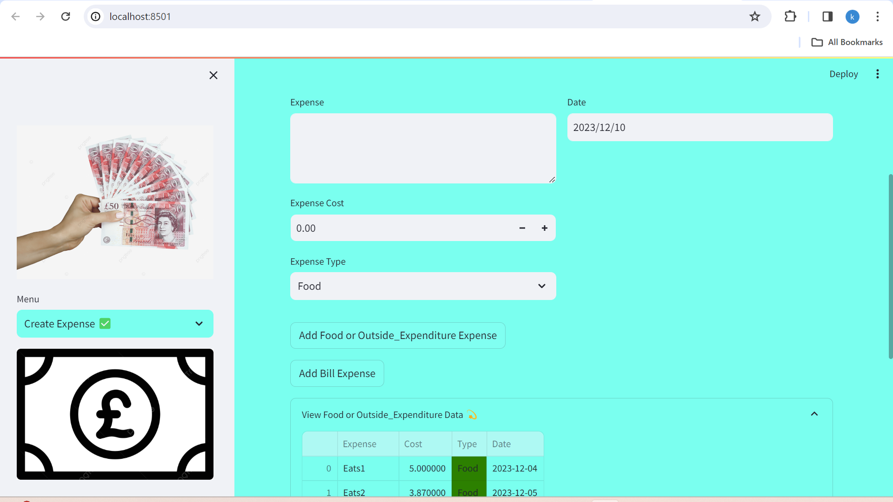
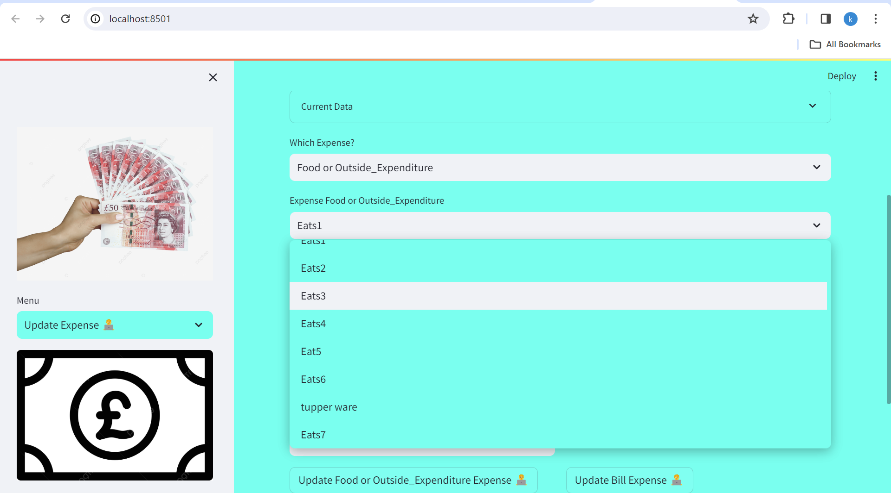
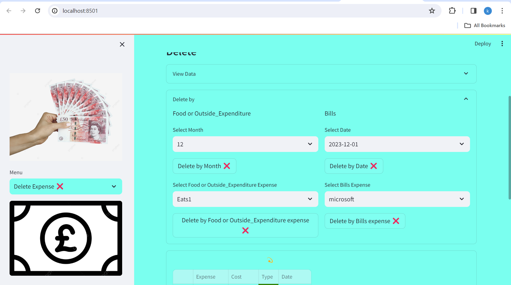
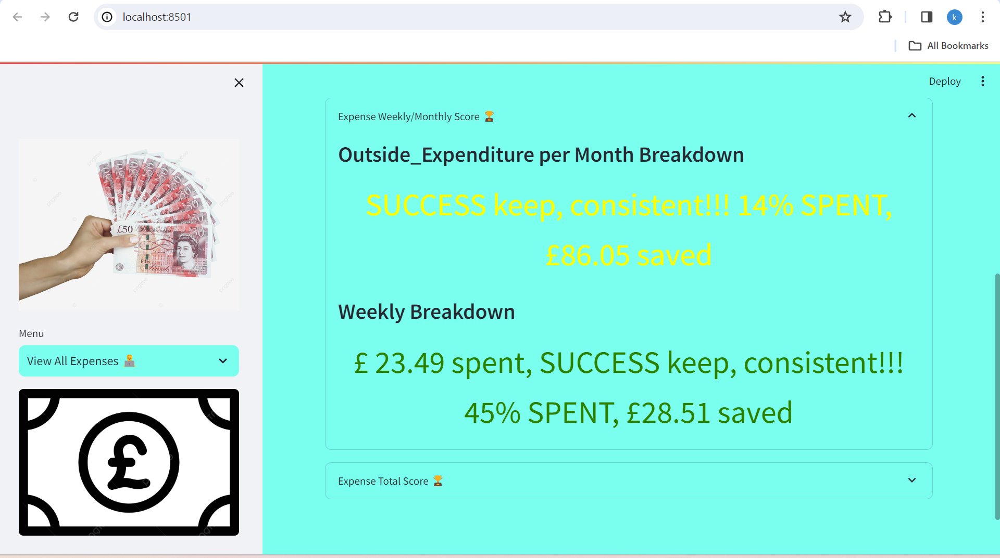

# Streamlit based Budgeting App 
A simple Streamlit based Budgeting App to stay on budget

### Create Expense ✅

### Update Expense 📝

### Delete Expense ❌

### View All Expenses 👨‍💻

## Installation:
* Simply run the command ***pip install -r requirements.txt*** to install the dependencies.

## Code Usage:
1. Clone this repository and install the required packages in requirements.txt
2. If you have preset bills, which you likely do update the dataframe information in db_funcs.py,
    create_table()
3. For the View All Expenses page, changes would have to be made to the budget variables for your liking
3. Simply run the script: run.py

